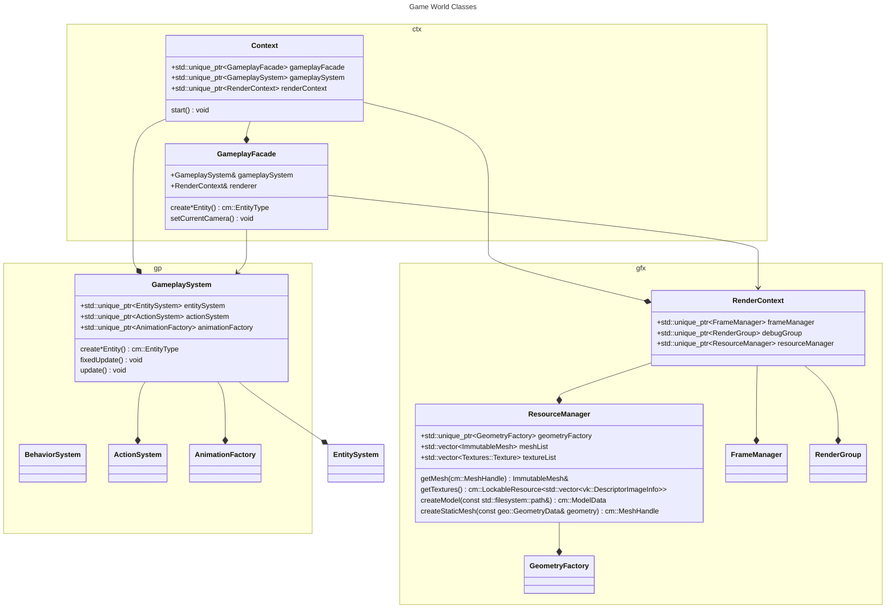
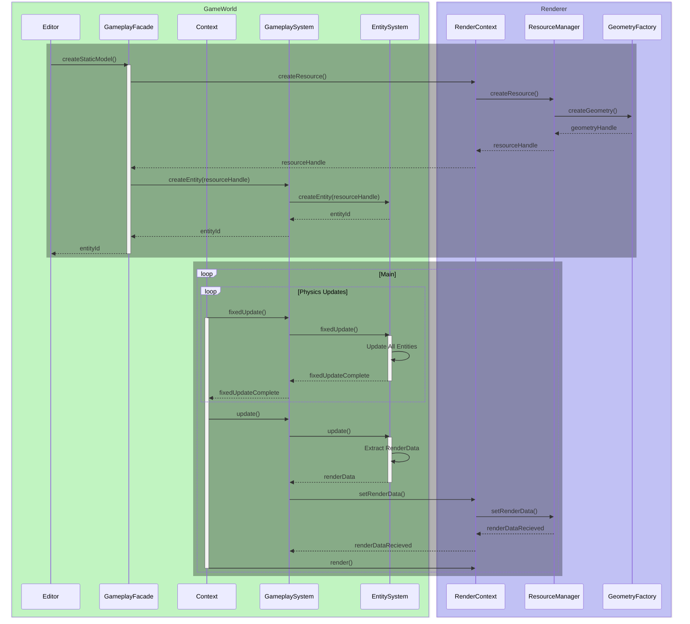
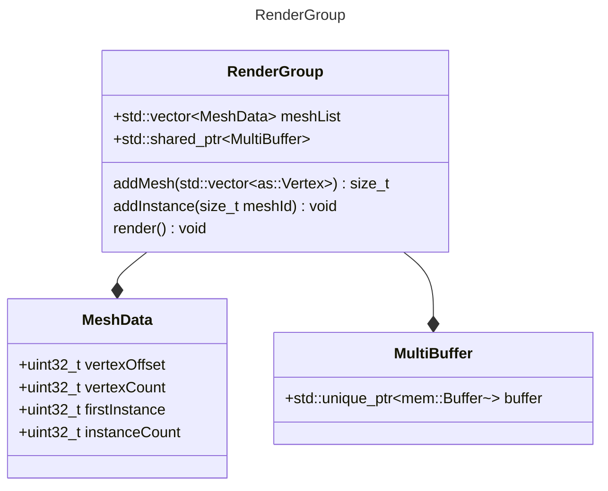
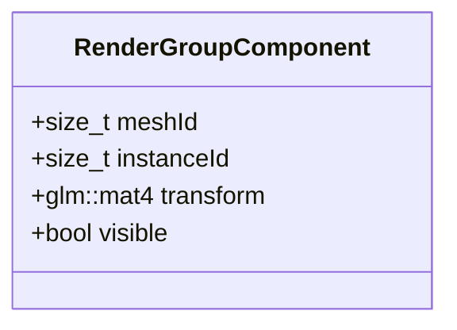

# Design Notes

## Debug Renderer

Each debug rendered item is going to be an entity in the ECS. A vertex buffer will need to be updated as the entities are created and destroyed.

Try out just encapsulating a buffer in an object that can have a smart pointer passed around instead of a handle. This object would be like a GeometryGroup that can encapsulate the creation and updating of a vertex buffer. It's api can handle adding new geometries, and removing them, internally tracking their elements in the buffer and indexing them by entity id.

Look into having these geometry groups be able to render themselves, initially via a single bind and multiple draw calls.

Multithreading concerns:
The issue is we need a consistent copy of the data to be rendered and copying renderdata handles ensures that i think?

Use these as an example of multiple types of things that need drawn so we can improve this process a bit.

An entity can have multiple meshes, and also multiple instances of each mesh.
Meshes instances can belong to multiple entities.

GeometryGroup should also internally maintain an ObjectData buffer that contains a minimum a model matrix for the time being. This can help ensure that vertex/index buffers, transform data, instance data and the object data buffer all stay coherent.

1 instance of a mesh.
Only a vertex buffer, not indexed yet.

addMeshInstance() - add vertex data and create an instance, returning both meshId and instanceId
removeInstance() - removes the instance and vertex data

render()

- Get rid of this loop with drawIndirect
- first just build the buffer on the CPU
- eventually send this GeometryGroup data to a compute shader and have the compute shader fill in the buffer based on frustum culling, etc
for ({id, meshData} : meshDataMap) {
   first instance will always be 0, since there will be one ObjectData buffer per GeometryGroup
   when drawing instanced, one draw call will cause the vertex shader to be called `instanceCount` times,
   incrementing the gl_InstanceIndex variable each time

   const auto vertexCount = meshData.vertexCount;
   const auto instanceCount = meshData.instanceData.size();
   const auto firstVertex = meshData.vertexOffset;
   const auto firstInstance = 0;

   cmd.draw(vertexCount, instanceCount, firstVertex, firstIndex);
}

GeometryGroup:

- `addMeshInstance(entityId, vertexData) -> {meshId, instanceId}`
- `removeInstance(entityId, instanceId) -> void`

- `render(vk::raii::CommandBuffer&)`

- `std::unique_ptr<mem::Buffer> vertexBuffer`
- `std::unordered_map<EntityId, MeshData> meshDataMap`

MeshData

- `uint32_t vertexCount`
- `int32_t vertexOffset`
- `std::vector<InstanceData> instanceData`

InstanceData

- `uint32_t instanceId`
- `uint32_t instanceOffset`

- init()
  - shaders
  - ShaderBindings
  - pipelines
  - Dynamic Vertex/Index Buffers
  - Transform buffer
  - Color buffer
  - common uniform buffer

- update()
  - copy buffers

- render()
  - bind buffers
  - draw indexed from the store

## Architecture Overview

### Triton (Engine Itself, static lib, `tr`)

#### Context `tr::ctx`

- Contains GameplaySystem and Renderer
- Handles decoupling the two so that renderer can be the only place where the graphics api is directly used.

#### Gameplay `tr::ctx::gp`

- Contain the ECS
- Provides GameplayAPI

#### Renderer `tr::ctx::gfx`

- Handles rendering and resource creation/management
- is completely unaware of which platform it's running on, and which windowing system has been used. The applications should be responsible for abstracting that away

### Editor (executable `tr::ed`

- Contains Imgui that can be handed to the renderer to be drawn
- Wires up window events, input callbacks etc into the context
- Wires up events Imgui needs
- Bridges Imgui components' inputs into the GameplayAPI
- Knows how to query the GamplayAPI in order to store game file(s)
- Knows how to read in game file(s) and set up the game using the GamplayAPI

### Game (executable `tr::gm`)

- Wires up things like window events, input callbacks, etc into the context.
- Reads optimized game files.
- Knows how to call the GameplayAPI with game file(s) information to set up and start the game.

## Component Detail

### Context

- News up a GameplaySystem and a Renderer, mediates communication between the two so they can stay decoupled.
- Recieves some sort of abstracted native window handle to be passed into the renderer's ctor so it knows where to render its output. (Vulkan will cast this to a GLFWwindow* in order to create the vk::Surface).
- Provides clients with a way to register application level callbacks and route them to the systems that need them.
- Provides clients access to the GameplayAPI.

### Gameplay API

Implemented as GameplayFacade class.

This API will sit on top of the ECS and essentially be an abstraction layer over it (like I didn't want to do).  This API will be available to the scripts attached to entities.  It will also be directly usable via the Editor's components as well.

API Needs:

- set state on a given entity (including adding/removing script components)
- query state of other entities
- create entities
- destroy entities
- create/read/update context data

Are these all anything will need to make a game? There may be certain things that make sense to build into the engine, terrain generation/paging, day night cycle for example.

### Editor

Editor should produce the imgui draw data and context should provide a listener to recieve changes in the imgui draw data each frame.

Context and renderer will only contain Imgui functions to render the draw data, nothing in here produces any draw data.

Editor Application will be the only component that calls any imgui functions to actually render any imgui components.

Imgui components in Editor's Application can have direct access to the GameplayFacade, this should be all they need to access in order to do what they need to do.

Imgui's edit components work by taking in a reference to some data to edit. I see 2 options here:

1. Create a copy of all the data in the Application and push that data into the GameplayFacade each frame
2. Have the GameplayFacade just expose references to all the data the gui will edit.

All data the editor will edit *should* be contained within the components of the ECS, so #2 is probably cleaner.

Should the script interface be the GameplayFacade as well? Probably, I think I decided that earlier.  Just need to figure out converting glm to and from Lua. I don't know, maybe we shouldn't be doing vector operations in a scripting language, and favor doing them in C++ where they're fast.

### Resource Updates

#### Models

- Offline process models from fbx into a model, animation, and skeleton
  - use the offline libs from ozz-animation to do this all in one step.

- Skeletons are what binds an animation to a model. Can have multiple animations per skeleton, and a skeleton can work for multiple models.
- The editor should have a frontend for the model tool, browse to a model file, and it runs the conversion and outputs the results into a working dir.
- For now, develop an executable tool that takes in an fbx file and produces a model, skeleton, and animation.
- The editor will just load in all 3 of these at once until the animation system is actually working
- The model file should just contain vertices and indices, and a map of vertex joint indices to skeleton joint indices so that the skeleton joints can be reordered into what the vertex data has.
- Milestone 1 is to be able to load a triplet of model, skeleton, animation, and have the debug UI able to test out the animation.
- Milestone 2 is to be able to associate multiple animations with a single model
- Milestone 3 is to be able to blend between animations eg: idle->walking->running-sprinting.

- rework the way assets in general are handled, the cmake targets are starting to feel clunky
- can be handled differently with the editor application as opposed to an exported game.
- editor should just access and load them from an external private 'assets' repository
- exported game should have them packaged up in some optimized format.
- Fonts: look at how Walnut embeds the font data and do that with the editor
- Models/Textures - see how gltf loading could automatically find and load textures referenced by gltf files.
- Shaders - The game currently loads and compiles text files into shaders, this should be moved into the editor level, an exported game won't be doing that, and in that case, the editor can just treat them like any other asset that is needed to initialize itself, like the icon.

1. Embed the font inside the code
1. Make static mesh loading just take a gltf file name and that's it
1. Move the shader compilation into the editor, and have the engine just take compiled spirv bytecode blobs.

### Misc Stuff to research

- ImGui logger output
- ImGui entity json viewer/editor
- ImGui Tests
- Terrain Generation/Rendering
- DrawIndirect
- Lighting
- Scripting

### Editor Save Data

Initially it seems like the whole game file could be a big gltf file, but the data will be more than just geometry and materials, there will be scripts attached to entities, cameras, environmental things. Effects and actions that are more than just geometry and materials.

EnTT's serialization is a little too bare bones and experimental feeling right now, also we don't want to just snapshot the entire state of the game.  For now start a json format that can be easily read, written and parsed, that should be good enough since it's only for the editor.  An actual game's format will need to be more optimized.

File Format see `.\project.json`

Right now, just a list of entities and their components.

Maybe have a EditorInfo component that only the editor uses to keep track of the assets used to create a given Renderable.  Could make the existing NameComponent more general until there is a need for the editor to query on separate components. Edit: this worked out well.

#### TODO

- Think about what an 'unloaded' state looks like. Should it be blank with just Imgui rendered, or should it start with a hardcoded scene like blender.
- Think about 'camera' more. Maybe the editor should always just supply a camera and don't bother writing it to the file, only reset its position when you load a different project.
  - Probably don't do too much with this until there's a need for multiple cameras, as it will change then anyway.
- Handle errors instead of crashing.

## Game World/Renderer Interaction







RenderGroup::render()

The components in the ECS will hold the game world data for the transform and visibility of each instance.



Preparing render data should put instance data into a

```c
std::unordered_map<meshId, std::unordered_map<instanceId, InstanceData>>
```

so that the RenderGroup can construct a single storage buffer containing the InstanceData, corresponding to the order of the meshes and instances. I don't think the order of the instances matters, so long as each bucket of instance data matches the correct mesh.
