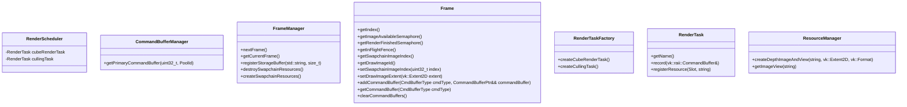

# RenderTask System

```mermaid
classDiagram
%% Core Classes
   class RenderScheduler {
      -RenderTask cubeRenderTask
      -RenderTask cullingTask
   }

   class CommandBufferManager {
      +getPrimaryCommandBuffer(uint32_t, PoolId)
   }

   class FrameManager {
      +nextFrame()
      +getCurrentFrame()
      +registerStorageBuffer(std::string, size_t)
      +destroySwapchainResources()
      +createSwapchainResources()
   }

   class Frame {
      +getIndex()
      +getImageAvailableSemaphore()
      +getRenderFinishedSemaphore()
      +getInFlightFence()
      +getSwapchainImageIndex() 
      +getDrawImageId()
      +setSwapchainImageIndex(uint32_t index)
      +setDrawImageExtent(vk::Extent2D extent)
      +addCommandBuffer(CmdBufferType cmdType, CommandBufferPtr&& commandBuffer)
      +getCommandBuffer(CmdBufferType cmdType)
      +clearCommandBuffers()
   }

   class RenderTaskFactory {
      +createCubeRenderTask()
      +createCullingTask()
   }

   class RenderTask {
      +getName()
      +record(vk::raii::CommandBuffer&)
      +registerResource(Slot, string)
   }

   class ResourceManager {
      +createDepthImageAndView(string, vk::Extent2D, vk::Format)
      +getImageView(string)
   }
```
