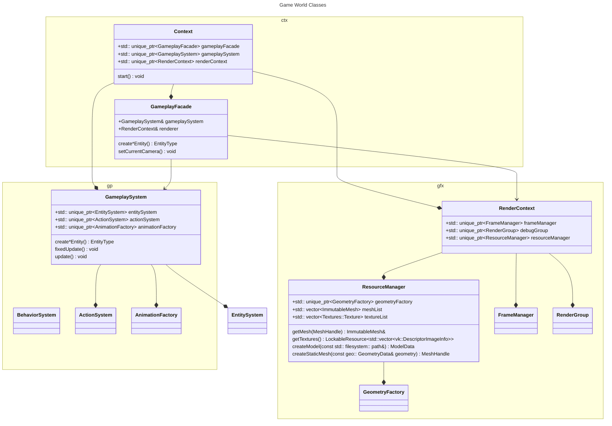
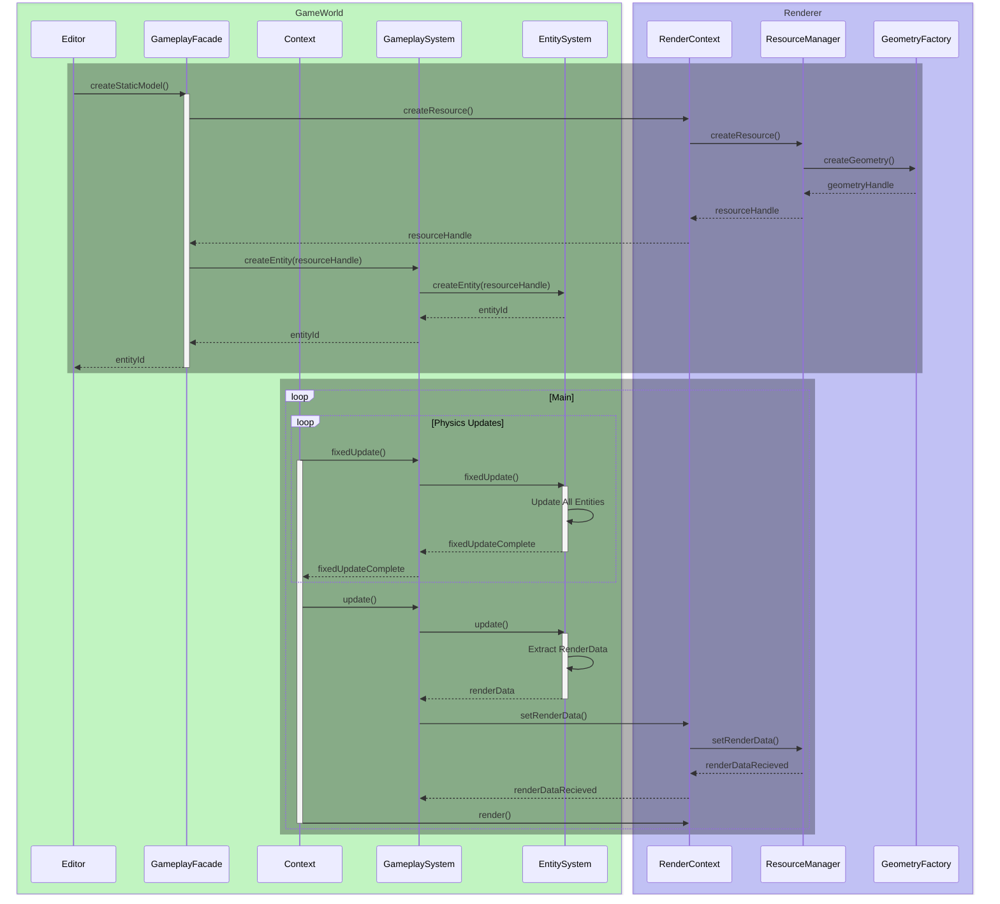
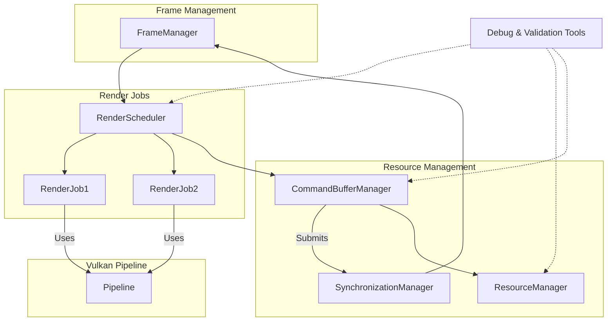
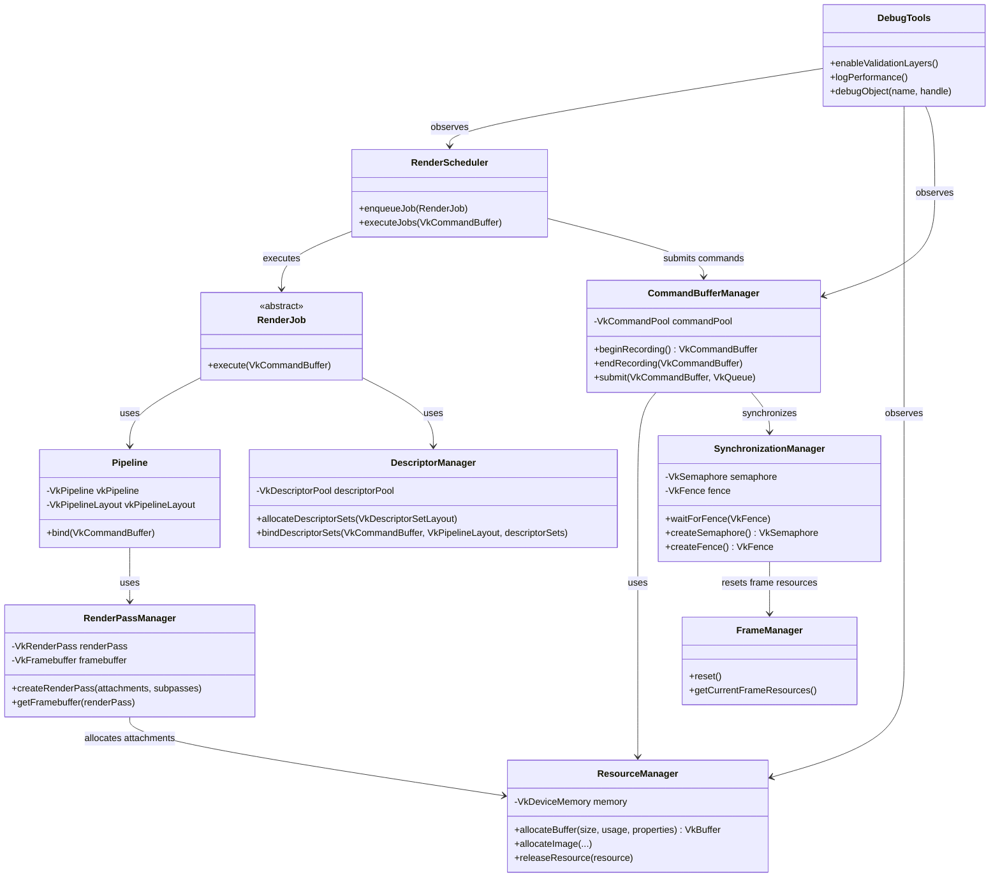

# Design Notes

## Game World/Renderer Interaction

```mermaid
---
title: Game World Classes
---
classDiagram
    namespace ctx {
        class Context {
            +std:: unique_ptr~GameplayFacade~ gameplayFacade
            +std:: unique_ptr~GameplaySystem~ gameplaySystem
            +std:: unique_ptr~RenderContext~ renderContext
            start() void
        }

        class GameplayFacade {
            +GameplaySystem& gameplaySystem
            +RenderContext& renderer
            create*Entity()  EntityType
            setCurrentCamera() void
        }
    }

    namespace gp {
        class GameplaySystem {
            +std:: unique_ptr~EntitySystem~ entitySystem
            +std:: unique_ptr~ActionSystem~ actionSystem
            +std:: unique_ptr~AnimationFactory~ animationFactory
            create*Entity()  EntityType
            fixedUpdate() void
            update() void
        }

        class BehaviorSystem {
        }

        class ActionSystem {
        }

        class AnimationFactory {
        }
    }
    namespace gfx {
        class RenderContext {
            +std:: unique_ptr~FrameManager~ frameManager
            +std:: unique_ptr~RenderGroup~ debugGroup
            +std:: unique_ptr~ResourceManager~ resourceManager
        }

        class ResourceManager {
            +std:: unique_ptr~GeometryFactory~ geometryFactory
            +std:: vector~ImmutableMesh~ meshList
            +std:: vector~Textures::Texture~ textureList
            getMesh( MeshHandle) ImmutableMesh&
            getTextures()  LockableResource~std::vector~vk::DescriptorImageInfo~~
            createModel(const std:: filesystem:: path&)  ModelData
            createStaticMesh(const geo:: GeometryData& geometry)  MeshHandle
        }

        class FrameManager {
        }

        class GeometryFactory {
        }

        class RenderGroup {
        }
    }
    Context --* GameplayFacade
    Context --* GameplaySystem
    Context --* RenderContext
    GameplayFacade --> GameplaySystem
    GameplayFacade --> RenderContext
    GameplaySystem --* EntitySystem
    GameplaySystem --* ActionSystem
    GameplaySystem --* AnimationFactory
    RenderContext --* FrameManager
    RenderContext --* RenderGroup
    RenderContext --* ResourceManager
    ResourceManager --* GeometryFactory
```

```mermaid
sequenceDiagram
    box rgba(0, 255, 0, 0.2) GameWorld
        participant Editor
        participant GameplayFacade
        participant Context
        participant GameplaySystem
        participant EntitySystem
    end
    box rgba(0, 0, 255, 0.2) Renderer
        participant RenderContext
        participant ResourceManager
        participant GeometryFactory
    end

    rect rgba(0, 0, 0, 0.3)
        Editor ->> GameplayFacade: createStaticModel()
        activate GameplayFacade
        GameplayFacade ->> RenderContext: createResource()
        RenderContext ->> ResourceManager: createResource()
        ResourceManager ->> GeometryFactory: createGeometry()
        GeometryFactory -->> ResourceManager: geometryHandle
        ResourceManager -->> RenderContext: resourceHandle
        RenderContext -->> GameplayFacade: resourceHandle
        GameplayFacade ->> GameplaySystem: createEntity(resourceHandle)
        GameplaySystem ->> EntitySystem: createEntity(resourceHandle)
        EntitySystem -->> GameplaySystem: entityId
        GameplaySystem -->> GameplayFacade: entityId
        GameplayFacade -->> Editor: entityId
        deactivate GameplayFacade
    end

    rect rgba(0, 0, 0, 0.3)
        loop Main
            loop Physics Updates
                Context ->> GameplaySystem: fixedUpdate()
                activate Context
                GameplaySystem ->> EntitySystem: fixedUpdate()
                activate EntitySystem
                EntitySystem ->> EntitySystem: Update All Entities
                EntitySystem -->> GameplaySystem: fixedUpdateComplete
                deactivate EntitySystem
                GameplaySystem -->> Context: fixedUpdateComplete
            end

            Context ->> GameplaySystem: update()
            GameplaySystem ->> EntitySystem: update()
            activate EntitySystem
            EntitySystem ->> EntitySystem: Extract RenderData
            EntitySystem -->> GameplaySystem: renderData
            deactivate EntitySystem
            GameplaySystem ->> RenderContext: setRenderData()
            RenderContext ->> ResourceManager: setRenderData()
            ResourceManager -->> RenderContext: renderDataRecieved
            RenderContext -->> GameplaySystem: renderDataRecieved
            Context ->> RenderContext: render()
            deactivate Context
        end
    end

```

## Render Job System

```mermaid
graph TD
    subgraph Frame Management
        FrameManager["FrameManager"]
    end

    subgraph Render Jobs
        RenderJob1["RenderJob1"]
        RenderJob2["RenderJob2"]
        RenderScheduler["RenderScheduler"]
    end

    subgraph Vulkan Pipeline
        Pipeline["Pipeline"]
    end

    subgraph Resource Management
        CommandBufferManager["CommandBufferManager"]
        ResourceManager["ResourceManager"]
        SynchronizationManager["SynchronizationManager"]
    end

    DebugTools["Debug & Validation Tools"]
%% Workflow connections
    FrameManager --> RenderScheduler
    RenderScheduler --> RenderJob1
    RenderScheduler --> RenderJob2
    RenderJob1 -->|Uses| Pipeline
    RenderJob2 -->|Uses| Pipeline
    RenderScheduler --> CommandBufferManager
    CommandBufferManager -->|Submits| SynchronizationManager
    CommandBufferManager --> ResourceManager
    SynchronizationManager --> FrameManager
    DebugTools -.-> RenderScheduler
    DebugTools -.-> ResourceManager
    DebugTools -.-> CommandBufferManager

```

```mermaid
classDiagram
%% Core Classes
    class FrameManager {
        +reset()
        +getCurrentFrameResources()
    }

    class RenderScheduler {
        +enqueueJob(RenderJob)
        +executeJobs(VkCommandBuffer)
    }

    class RenderJob {
        <<abstract>>
        +execute(VkCommandBuffer)
    }

    class Pipeline {
        +bind(VkCommandBuffer)
        -VkPipeline vkPipeline
        -VkPipelineLayout vkPipelineLayout
    }

    class DescriptorManager {
        +allocateDescriptorSets(VkDescriptorSetLayout)
        +bindDescriptorSets(VkCommandBuffer, VkPipelineLayout, descriptorSets)
        -VkDescriptorPool descriptorPool
    }

    class CommandBufferManager {
        +beginRecording() VkCommandBuffer
        +endRecording(VkCommandBuffer)
        +submit(VkCommandBuffer, VkQueue)
        -VkCommandPool commandPool
    }

    class ResourceManager {
        +allocateBuffer(size, usage, properties) VkBuffer
        +allocateImage(...)
        +releaseResource(resource)
        -VkDeviceMemory memory
    }

    class RenderPassManager {
        +createRenderPass(attachments, subpasses)
        +getFramebuffer(renderPass)
        -VkRenderPass renderPass
        -VkFramebuffer framebuffer
    }

    class SynchronizationManager {
        +waitForFence(VkFence)
        +createSemaphore() VkSemaphore
        +createFence() VkFence
        -VkSemaphore semaphore
        -VkFence fence
    }

%% Relationships
    RenderScheduler --> RenderJob: executes
    RenderJob --> Pipeline: uses
    RenderJob --> DescriptorManager: uses
    Pipeline --> RenderPassManager: uses
    RenderScheduler --> CommandBufferManager: submits commands
    CommandBufferManager --> ResourceManager: uses
    RenderPassManager --> ResourceManager: allocates attachments
    CommandBufferManager --> SynchronizationManager: synchronizes
    SynchronizationManager --> FrameManager: resets frame resources
%% Optional Component
    class DebugTools {
        +enableValidationLayers()
        +logPerformance()
        +debugObject(name, handle)
    }
    DebugTools --> RenderScheduler: observes
    DebugTools --> ResourceManager: observes
    DebugTools --> CommandBufferManager: observes

```
